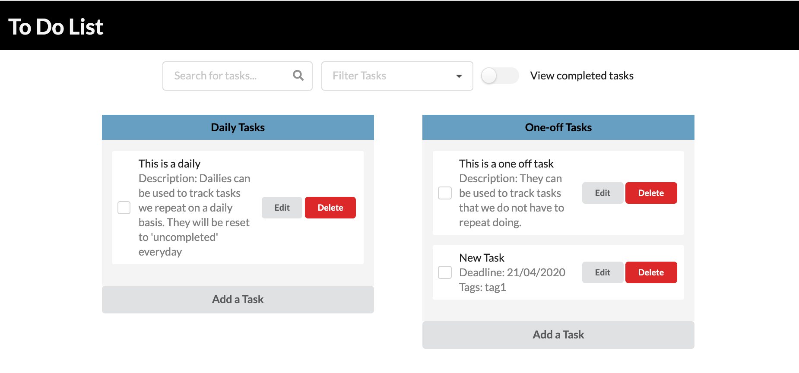

# cvwo-assignment-2019

This is a ToDo list web app, created in React on Rails for the CVWO Winter Assignment 2019.

Name: Chow Jia Ying

Matriculation number: A0187457M

Mid-submission:

* Mid-submission documents are in the [mid-submission folder](https://github.com/C-likethis123/cvwo-assignment-2019/tree/master/mid-submission).

Final submission:

* The application, deployed to Heroku, can be found [here](http://tranquil-cliffs-23183.herokuapp.com/).
* The final write up can be found in [this folder](https://github.com/C-likethis123/cvwo-assignment-2019/tree/master/final-submission).

## Developing and installing

1. Clone this repository
2. Install postgres - `brew install postgres` and start postgres
3. Install dependencies - `bundle install`
4. Set up webpacker - `bundle exec rake webpacker:install`
5. Set up database - `rake db:create` then `rake db:migrate`
6. Running a dev server - `rails s`
